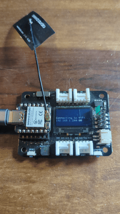
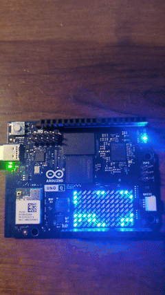
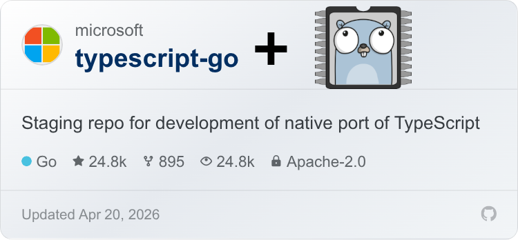
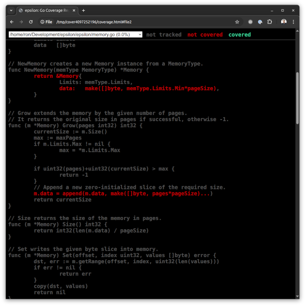

The new [TinyGo 0.41 release](https://github.com/tinygo-org/tinygo/releases/tag/v0.41.0) is the most feature packed yet with over 150 commits to our main repo alone. We added Go 1.26 support to keep you up to date with the [latest work from the mothership](https://go.dev/blog/go1.26). We also have many improvements to our developer tooling and compatibility. And some big news when it comes to hardware support.

## ESP32 - At Long Last, Wireless

This release has heavily focused on the ESP32xx family, thanks to our amazing collaborations with [Espressif](http://espressif.com/) and [Seeed Studio](https://www.seeedstudio.com/). TinyGo now has wireless support on the [`ESP32-C3`](https://www.espressif.com/en/products/socs/esp32-c3) single-core 32-bit RISC-V processor and [`ESP32-S3`](https://www.espressif.com/en/products/socs/esp32-s3) dual-core XTensa LX7 processors. That means you can run a web server or MQTT messaging client right on your ESP32 board using the same language that powers your cloud infrastructure!

The ESP32 radio communication uses our new "espradio" package. Currently supports WiFi, with Bluetooth in progress along with more processors.

https://github.com/tinygo-org/espradio

We also added the ability for TinyGo to flash your ESP32 boards directly without any external tools, thanks to our new "espflasher" package.

https://github.com/tinygo-org/espflasher

To show a few possibilities, we have created a repo with 8 different TinyGo examples focused on the [Seeed Studio XIAO-ESP32C3](https://www.seeedstudio.com/Seeed-XIAO-ESP32C3-p-5431.html) and [Seeed Studio XIAO-ESP32S3](https://www.seeedstudio.com/XIAO-ESP32S3-p-5627.html) boards. The examples range from a basic blinky to full WiFi, showcasing some capabilities of the new TinyGo release.

https://github.com/tinygo-org/tinygo-xiao-examples

## Arduino UNO Q Springs To Life

Working closely with the team from [Arduino](https://www.arduino.cc/) this release adds the new [Arduino UNO Q](https://store.arduino.cc/pages/uno-q) to TinyGo. The Arduino UNO Q has both a [Qualcomm Dragonwing QRB2210 MPU](https://www.qualcomm.com/internet-of-things/products/q2-series/qrb2210) and also an onboard [STMicro STM32U585 MCU](https://www.st.com/en/microcontrollers-microprocessors/stm32u575-585.html). We now support many of the features of this intriguing hybrid of microcontroller and single board Linux computer.

TinyGo can flash the Arduino UNO Q board's STM32U585 directly from your computer using a USB-C cable with the `adb` interface, or on a network using `ssh`.

Need GPIO, ADC, PWM, SPI, and I2C interfaces? TinyGo has you covered.

We also added support for the Arduino UNO Q built-in LED matrix to the over 140 different sensors, displays, and other devices already in the TinyGo `drivers` repo:

https://github.com/tinygo-org/drivers

Want to see some of what you can do? We created a repo with different examples for the Arduino UNO Q. They range from the "hello world of things" aka a blinking LED, to the [Conway's "Game of Life"](https://en.wikipedia.org/wiki/Conway%27s_Game_of_Life) example pictured above, to showing how to combine both the microcontroller and the Linux machine together to talk to sensors from a web server all running right on the board itself.

https://github.com/tinygo-org/tinygo-arduino-unoq-examples

## WebAssembly - The Outer Limits

The new release continues to push the limits of [WebAssembly](https://webassembly.org/) and the Go language. Thanks to the tireless efforts of our core team members at [Microsoft](http://microsoft.com/) and [Fastly](https://www.fastly.com/), TinyGo can now compile and run the popular high-performance [TypeScript-Go compiler](https://devblogs.microsoft.com/typescript/typescript-native-port/)! Yes, you read that correctly: a TypeScript compiler written in Go that can be compiled with TinyGo.

https://github.com/microsoft/typescript-go

The result is that with greatly improved reflection support, many more `stdlib` packages are functioning. Not all of the unit tests from "Big" Go are passing quite yet. However, more packages may now work well enough for your needs. Give it a try!

We've also enhanced other important features for WASI compatibility, and improved networking support for WASM programs executing in-browser.

## Developers, Are You Experienced?

This release also includes a number of new or improved features intended to make your experience developing with TinyGo just a little bit better. For example, tired of chasing down those pesky heap allocations that use up your precious device memory? The improved `-print-allocs` output format now matches the Go coverage tool format, so you can just run `go tool cover -html=allocs.out` and see what is going on.

These are only some of the features and fixes included in the new release. See the [CHANGELOG](https://github.com/tinygo-org/tinygo/releases/tag/v0.41.0) for the complete list.

## Thank You To The Community

Thank you very much to all of the many people who worked on code, testing, documentation, and helping cheer us on. TinyGo only exists because of the dedicated human beings across the globe who collaborate together to create this remarkable project.

Also thank you to our sponsors such as [GoBridge](https://gobridge.org/), [BridgeFoundry](https://bridgefoundry.org/), and the [Google Open Source Office](https://opensource.google/) for your support. We appreciate it!

Want to help us out? Go to https://opencollective.com/tinygo
