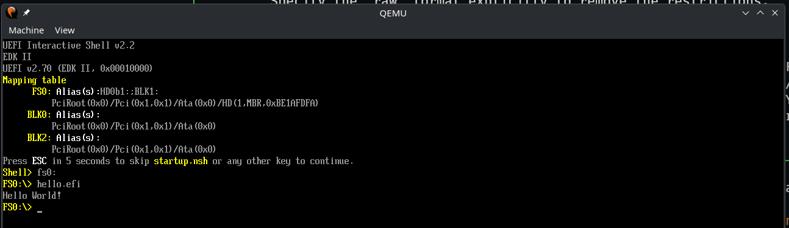

The new [TinyGo 0.42 release](https://github.com/tinygo-org/tinygo/releases/tag/v0.42.0) is out, and closes one of the oldest gaps between TinyGo and "Big" Go. Runtime panics can now be recovered. We also added Go 1.27 support to keep you up to date with the [latest and greatest](https://go.dev/blog/go1.27), moved to [LLVM 22](https://llvm.org/), and brought TinyGo to a completely new class of machine.

## Go 1.27 and LLVM 22

TinyGo 0.42 adds support for Go version to 1.27, and the binaries we release with the compiler are built and tested with it. Generic methods, new in Go 1.27, are supported through an upgrade of `golang.org/x/tools`.

We also moved our builds to LLVM 22, while keeping LLVM 19 and LLVM 20 working for people who build from a distribution package. See the [Go compatibility matrix](/docs/reference/go-compat-matrix/) for the full picture of which TinyGo release works with which Go release.

## Recover Is Real Now

Before this release, a nil pointer dereference or a divide by zero in a TinyGo program was the end of the story. Your program just stopped. That is no longer the case, thanks to the tireless efforts of our erstwhile maintainers.

TinyGo 0.42 now makes runtime panics recoverable. Nil pointer dereferences, divide by zero, out of range slice and map operations, and channel panics all are handled through `defer` and `recover` the way you expect them to. On Windows we added a vectored exception handler to do the same job, and `recover` now works on riscv64 as well.

The runtime knows which panics you can handle and the failures you cannot. Out of memory and other fatal errors stay unrecoverable, because there is nothing you can really do about it.

This work reaches much further than error handling. The `testing` package now supports `Goexit`, `SkipNow`, and `FailNow`, so `t.Skip` and `t.Fatal` behave correctly. That single change unblocked a large number of standard library test suites. Take a look at the updated [list of supported packages](/docs/reference/lang-support/stdlib/) to see where things stand.

## TinyGo Boots Your Computer

This release adds a minimal [UEFI](https://uefi.org/) target. You can now write a Go program, compile it with TinyGo, and run it as a UEFI application before any operating system starts. The target supports UEFI time and events, and it uses the tasks scheduler by default so goroutines work.

This is early work, and there is a lot still to do. It is also a good demonstration of how far the compiler has come.

## ESP32 Grows Up

[Espressif](https://www.espressif.com/) chips with their powerful wireless capabilities are some of the most popular around, and the ESP32 work that started in 0.41 has continued at full speed in this release. You probably still have a bunch of classic (old?) ESP32 boards in a drawer. Now you can pull them out and put them to work! We have interrupt support with a proper vector table, timer alarms, and `SetInterrupt` on GPIO pins for the original ESP32. It also gained an ADC driver, interrupt-driven UART receive, and flash XIP, which means execute in place. Larger programs now flash and run correctly. We have even added WiFi support, thanks to the [espradio](https://github.com/tinygo-org/espradio) package.

Speaking of wireless, we now also support Bluetooth on both the ESP32-C3 and ESP32-S3.

## More Chips, More Boards

STM32 users also get a lot in this release. There is a new OTG FS USB driver for the F4 and F7 families, new support for the STM32H7 and the NUCLEO-H753ZI board, support for the STM32U031 chip, a selectable HSE crystal frequency, and fixes to UART transmission, baud rates, and interrupt handling.

Other new hardware in this release:

* Puya PY32F microcontrollers
* Pimoroni Blinky 2350 and Badger 2350
* The 'Plus' variant of the Seeed Studio XIAO nRF52840
* mGBA debugging support for the Game Boy Advance

USB support improved across the board. Endpoints are now registered dynamically, which brings bidirectional endpoint support to RP2, SAMD21, SAMD51, and nRF52840. Descriptors are generated dynamically, and there are new `USBDevice.Attach` and `USBDevice.Detach` methods.

These are only some of the features and fixes included in the new release. See the [CHANGELOG](https://github.com/tinygo-org/tinygo/releases/tag/v0.42.0) for the complete list.

## Thank You, Fellow Humans!

As always, we must say special thanks to the humans who work behind the scenes on writing code, testing, creating documentation, and everything else it takes to make TinyGo real. You are appreciated!
