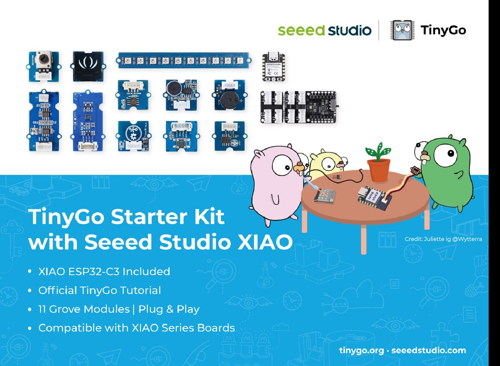
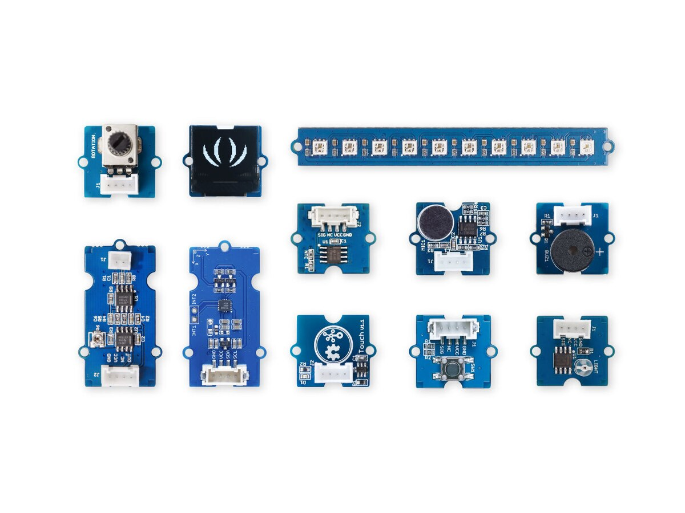

*Gopher artwork by Juliette ([@wytterra](https://www.instagram.com/wytterra/))*

As you should already know, TinyGo ❤️ the Seeed Studio XIAO boards. Since "Xiao" actually means "Tiny" in Chinese, of course it is a natural fit.

So today we get to share something new: the [**TinyGo Starter Kit with Seeed Studio XIAO**](https://www.seeedstudio.com/tinygo-xiao-starter-kit.html). Open the box and you will find a XIAO ESP32-C3, a Grove Base for XIAO, eleven Grove modules that we picked out one at a time, and a tutorial series that walks you through every one of them. The idea was not to hand you a pile of parts, but to give you a clear path from your first `tinygo flash` to a gadget that actually does something.

This is the very first TinyGo kit, so a big thank you to the team at [Seeed Studio](https://www.seeedstudio.com/) for working alongside us to figure out what belongs in it.

## What Is In The Box

If you have ever sat down at one of our "Hardware Hack Sessions" and wished you could keep tinkering afterwards with your own set of parts, this one is for you. And if you have only ever watched the photos go by online, consider yourself covered too.

### XIAO ESP32-C3

Running the show is the XIAO ESP32-C3, a RISC-V board roughly the size of a postage stamp that shows up with 2.4GHz WiFi and BLE radios already on board. It is the brain that talks to every sensor and to the display, and it is what all of the tutorial code runs on.

Got a different XIAO already sitting in a drawer? TinyGo speaks to the rest of the family as well, so the ESP32-S3, nRF52840, RP2040, RP2350, and SAMD21 flavors will all happily take the place of the C3 without you changing anything else in the kit.

| XIAO Board | TinyGo Support |
|---|---|
| XIAO ESP32-C3 | Supported, with WiFi and Bluetooth |
| XIAO ESP32-S3 | Supported, with WiFi and Bluetooth |
| XIAO RP2040 | Supported |
| XIAO RP2350 | Supported |
| XIAO nRF52840 | Supported, with Bluetooth |
| XIAO SAMD21 | Supported |

### Grove Base for XIAO

The part that removes most of the fiddling is the Grove Base for XIAO. There is no breadboard to wire up and no jumper wires to double check. Plug the module in by its Grove connector, and away you Go.

### 11 Grove Modules

Eleven modules ride along in the box, which between them cover the three things pretty much every embedded project ends up doing:

* **Sense the world**: button, touch, rotary angle, light, sound, temperature, vibration, and acceleration.
* **Do something about it**: buzzer and RGB LED stick.
* **Show you what happened**: OLED display.

## Need Tutorials? We Got You

A box of hardware on its own is just a box of hardware, so [Patricio Whittingslow](https://github.com/soypat) from the TinyGo core team wrote a [tutorial series](https://github.com/soypat/tinygo-seeed-grove) built specifically around this kit.

It opens where you would expect, getting TinyGo installed and your first program flashed onto the XIAO ESP32-C3. Digital inputs come next, starting with the button and the touch sensor, then the analog side of things. After that the display shows up so your program can report back, and finally the radios come out to play for some wireless communication.

## TinyGo At Home

Everything in the box points in the same direction: pick an idea, then go build it. That might turn out to be a sensor that finally tells you when the laundry is done, a desk toy that nobody asked for, or a weekend experiment you will have real trouble explaining to your friends. All of them count.

Ready to Go? [Grab the TinyGo Starter Kit with Seeed Studio XIAO](https://www.seeedstudio.com/tinygo-xiao-starter-kit.html) and then show us what you made.
