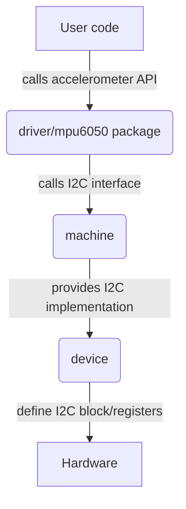

Drivers are packages to make it easier for TinyGo programs to use sensors, displays, and other external hardware that can be physically connected to a microcontroller.

Here is an example of a TinyGo program that uses a BMP180 digital temperature sensor by way of the [I2C interface](../peripherals/i2c):

```go
package main

import (
    "time"

    "machine"

    "tinygo.org/x/drivers/bmp180"
)

func main() {
    machine.I2C0.Configure(machine.I2CConfig{})
    sensor := bmp180.New(machine.I2C0)
    sensor.Configure()

    connected := sensor.Connected()
    if !connected {
        println("BMP180 not detected")
        return
    }
    println("BMP180 detected")

    for {
        temp, _ := sensor.ReadTemperature()
        println("Temperature:", float32(temp)/1000, "°C")

        pressure, _ := sensor.ReadPressure()
        println("Pressure", float32(pressure)/100000, "hPa")

        time.Sleep(2 * time.Second)
    }
}
```

You can find all of the TinyGo drivers in the repository located at [https://github.com/tinygo-org/drivers](https://github.com/tinygo-org/drivers).

## How Drivers Work

Most, if not all, microcontrollers have hardware peripheral blocks that provide low-level implementations of protocols like I2C, SPI, etc. But these blocks provide only very low level functions. They must be put together in order to actually do something functional on that microcontroller. 

TinyGo defines Go language interfaces for I2C, SPI, and other peripherals, and then implements these interfaces by utilizing the microcontroller blocks and registers. This is what is in the TinyGo `machine` package.

Creating a TinyGo driver for a sensor, is to consume the interfaces defined by TinyGo for that peripheral such as I2C and then to use those to implement whatever communication is needed for a particular device to work. 

Here is a diagram showing a specific example of this for an MPU6050 digital accelerometer:



For example, the MPU6050 has specific commands that it expects to be sent via I2C in order to return accelerometer data. The TinyGo driver provides functions like `ReadAccelerometer()` so you can use the sensor from a TinyGo program. 

These functions call the I2C functions in TinyGo which are implemented by the `machine` package. The `machine` package then uses the `device` package for that microcontroller to call the low level MCU functions needed to get their work done.
