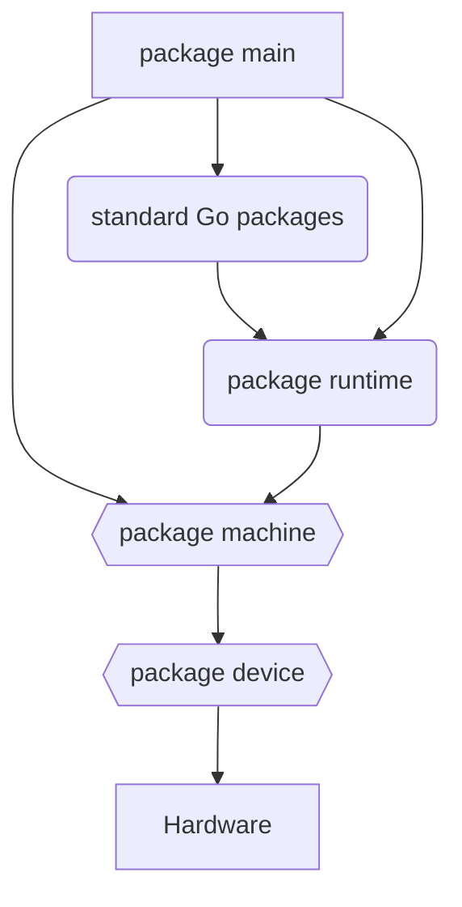

The `main` package is the main entry point to your program, just like any other Go program. Typically you will import other packages and then call them from your package. The subpackages for your application are compiled in the same way as any other Go package by the TinyGo compiler. At some point, you will want to call the Go standard library packages to do things.

The standard Go library packages along with any third-party Go language packages are compiled and linked together by TinyGo. Their implementations will commonly call the `runtime` package for low-level functionality.

The `runtime` package that will be used is the TinyGo implementation of the Go runtime. This is needed to run bare metal on whatever hardware is being targeted by your compiled code. The TinyGo `runtime` package implementation can call the TinyGo `machine` package for specific hardware features.

The `machine` package is the TinyGo hardware abstraction layer. The interfaces that it exposes are the same regardless of the implementation of the target hardware. For example, to use whatever serial ports or timer are built-in to the target chip.

The `device` package is a set of generated Go types, each of which wraps the low-level registers for a particular chip. You generally would only use them directly when you are adding support to TinyGo for a new chip.
